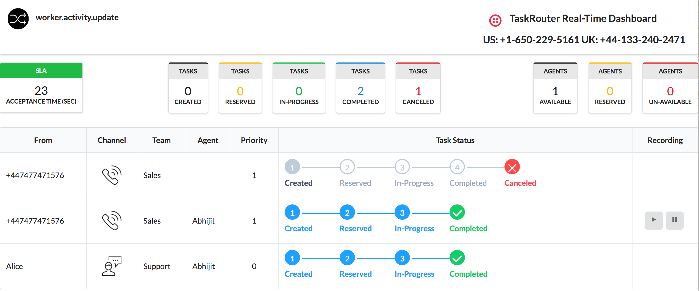

# Twilio TaskRouter Realtime Dashboard using Sync

In a modern contact center that serves customers over multiple channels, realtime monitoring of the tasks and their progress becomes an operational imperative.  Twilio provides all the necessary building blocks to build a contact center (https://github.com/nash-md/twilio-contact-center) and the ability to build a realtime task monitoring dashboard using Twilio Sync (https://www.twilio.com/sync).

This demo shows how an operational monitoring dashboard could be built.  I've used the following technologies to built this dashboard:

## Technologies
1) Twilio TaskRouter (https://www.twilio.com/taskrouter)
2) Twilio Sync (https://www.twilio.com/sync)
3) Server side app using Python and Twilio REST APIs (TaskRouter, Sync)
4) Dashboard app components:
  1) Javascript framework Vue.js (https://vuejs.org)
  2) UI framework Semantic-ui (https://semantic-ui.com)
  3) Twilio Sync JS SDK (https://www.twilio.com/docs/api/sync/quickstart-js)

## Data flow
1) Taskrouter generates the events stream and send it to the Event Callback URL
2) This invokes the server side python app to consume the event and call additional Twilio TaskRouter Statistics APIs to get aggregated statistics
3) Next, the Sync documents are updated with changes using the Sync REST APIs
4) The frontend web app subscribes to the same Sync documents for changes vis the Sync JS SDK
5) When changes are detected by the frontend, the UI is updated
6) All this happens in near realtime!

Note: Please keep in mind the source code shared here (JS and Python) is pretty much demo quality.  For production use, I am sure the code can be optimized significantly.

# Setup

## Step 1: Installing the web app
This will install the web application and all the dependencies on Heroku (login required) for you. As part of the installation, the Heroku app will walk you through configuration of environment variables.  Please click on the following button to deploy the application.

### One Click Heroku Deploy of Web App

Make a note of the URL that Heroku creates as you'll need it for the next Step

## Step 2: Configuring Taskrouter Workspace
